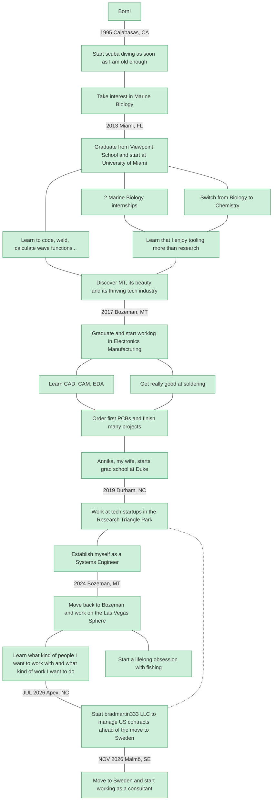

# How did I get here?

```mermaid
graph TD;
    A[Born!] --1995 Calabasas, CA--- B[Start scuba diving as soon as I am old enough];
    B --- C[Take interest in Marine Biology];
    C --2013 Miami, FL--- D[Graduate from Viewpoint School and start at University of Miami];
    D --- E[2 Marine Biology internships];
    D --- F[Switch from Biology to Chemistry];
    D --- G[Learn to code, weld, calculate wave functions...] --- I;
    E --- H[Learn that I enjoy tooling more than research];
    F --- H --- I[Discover MT, its beauty and its thriving tech industry];
    I --2017 Bozeman, MT--- J[Graduate and start working in Electronics Manufacturing];
    J --- K[Learn CAD, CAM, EDA];
    K --- L[Order first PCBs and finish many projects];
    J --- M[Get really good at soldering];
    M --- L --- N[Annika, my wife, starts grad school at Duke];
    N --2019 Durham, NC--- O[Work at tech startups in the Research Triangle Park];
    O --- P[Establish myself as a Systems Engineer];
    P --2024 Bozeman, MT--- Q[Move back to Bozeman and work on the Las Vegas Sphere];
    Q --- R[Learn what kind of people I want to work with and what kind of work I want to do];
    Q --- S[Start a lifelong obsession with fishing];
    R --JUL 2026 Apex, NC--- T[Start bradmartin333 LLC to manage US contracts ahead of the move to Sweden];
    O -.- T;
    T --NOV 2026 Malmö, SE--- U[Move to Sweden and start working as a consultant];
    classDef default fill:#cef0da,stroke:#4a9c6a
```

# [Return to Home](../index.html)
